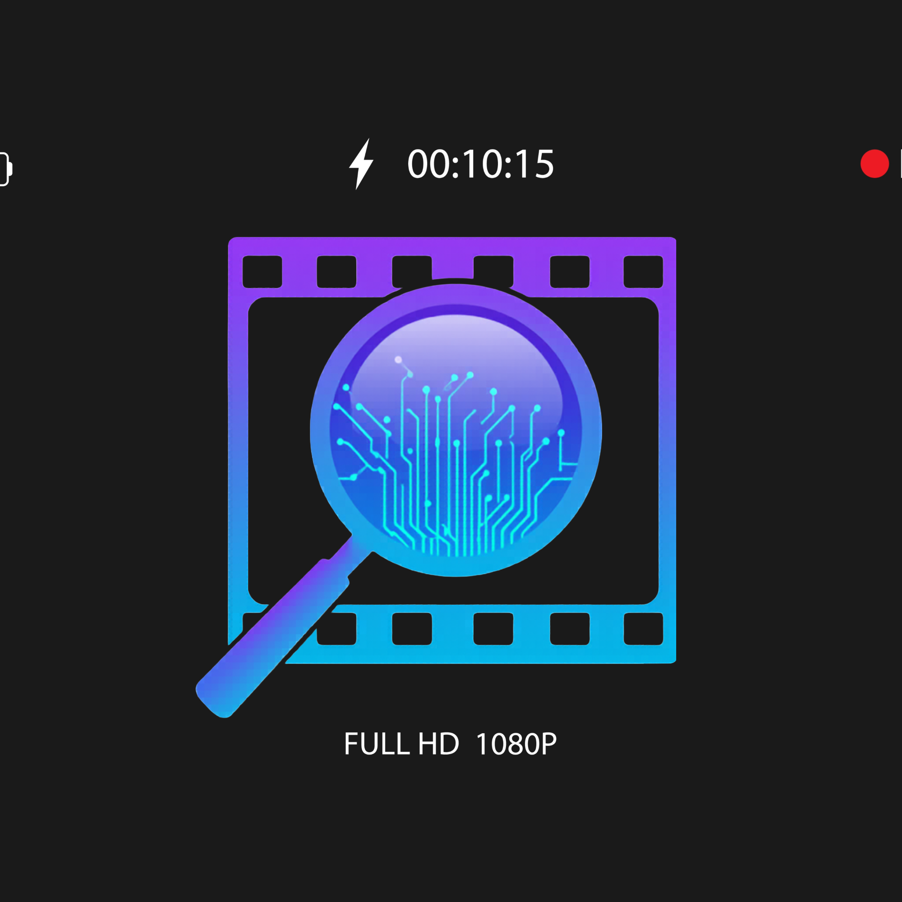

# VeraFrame — Truth in Every Frame

> AI-powered video and image authenticity detector. Upload a video, image, or YouTube URL and VeraFrame analyzes frames, transitions, pixel-level manipulation, and metadata to determine if content is AI generated or edited.



---

## What it detects

| Signal | Method | Catches |
|--------|--------|---------|
| AI generation | Gemini Vision per-frame analysis | Sora, Kling, Runway, DALL-E |
| Impossible physics | Gemini transition analysis | Animals teleporting, objects morphing |
| Image manipulation | Error Level Analysis (ELA) | Photoshop, color edits, compositing |
| Editing software | EXIF metadata inspection | Lightroom, Canva, Facetune |

### Four verdicts
- 🤖 **AI Generated** — strong AI signals in frames or transitions
- ⚠️ **Possibly AI Generated** — weak AI signals, treat with caution  
- ✂️ **Possibly Edited** — visually real but forensic analysis detected manipulation
- ✅ **Likely Real** — no AI or manipulation signals found

---

## Tech Stack

**Backend**
- Python 3.12 + FastAPI
- FFmpeg — smart frame extraction based on video duration
- Google Gemini Vision (`gemini-2.5-flash-preview`) — frame + transition analysis
- Pillow + NumPy — ELA (Error Level Analysis) for manipulation detection
- yt-dlp — YouTube and URL video downloading
- Server-Sent Events (SSE) — real-time progress streaming

**Frontend**
- Next.js 14 + TypeScript
- Tailwind CSS
- Cabinet Grotesk + Instrument Sans fonts
- Real-time SSE progress bar

---

## How it works

```
User uploads video / image / YouTube URL
              ↓
FFmpeg extracts up to 10 frames
(frame rate adapts to video duration)
              ↓
    ┌─────────────────────────┐
    │   Per-frame analysis    │  ← Gemini Vision checks each frame
    │   (40% of final score)  │     for AI artifacts + physics errors
    └─────────────────────────┘
              ↓
    ┌─────────────────────────┐
    │  Transition analysis    │  ← Gemini checks consecutive frame
    │   (60% of final score)  │     pairs for impossible changes
    └─────────────────────────┘
              ↓
    ┌─────────────────────────┐
    │   Forensic analysis     │  ← ELA detects pixel manipulation
    │   (overrides verdict)   │     Metadata checks editing software
    └─────────────────────────┘
              ↓
         Unified scorer
         builds verdict
              ↓
    SSE streams progress to
    frontend in real-time
```

---

## Project Structure

```
veraframe/
├── backend/
│   ├── main.py          # FastAPI routes (thin layer)
│   ├── extractor.py     # FFmpeg frame extraction
│   ├── analyzer.py      # Gemini Vision + ELA + metadata
│   ├── scorer.py        # Verdict + confidence scoring
│   ├── models.py        # Shared constants
│   └── requirements.txt
└── frontend/
    ├── app/
    │   ├── page.tsx
    │   ├── globals.css
    │   ├── layout.tsx
    │   ├── components/
    │   │   ├── DropZone.tsx
    │   │   ├── ProgressBar.tsx
    │   │   └── Results.tsx
    │   └── lib/
    │       └── api.ts
    └── package.json
```

---

## Getting Started

### Prerequisites
- Python 3.9+
- Node.js 18+
- FFmpeg
- Google API key (Gemini)

### Install FFmpeg (Mac)
```bash
brew install ffmpeg
```

### Backend Setup
```bash
cd backend
python -m venv venv
source venv/bin/activate
pip install -r requirements.txt
```

Create `.env` file:
```
GOOGLE_API_KEY=your_google_api_key_here
```

Start the server:
```bash
uvicorn main:app --reload
```

Backend runs on `http://localhost:8000`

### Frontend Setup
```bash
cd frontend
npm install
npm run dev
```

Frontend runs on `http://localhost:3000`

---

## API Endpoints

| Method | Endpoint | Description |
|--------|----------|-------------|
| `GET` | `/health` | Check API status + key loaded |
| `POST` | `/analyze-stream` | Upload video file (SSE streaming) |
| `POST` | `/analyze-url-stream` | Analyze YouTube/video URL (SSE streaming) |
| `POST` | `/analyze-image` | Analyze single image |

### Example — analyze a video file
```bash
curl -X POST http://localhost:8000/analyze-stream \
  -F "file=@video.mp4"
```

### Example — analyze a YouTube URL
```bash
curl -X POST http://localhost:8000/analyze-url-stream \
  -H "Content-Type: application/json" \
  -d '{"url": "https://youtube.com/watch?v=..."}'
```

### Response shape
```json
{
  "verdict": "AI Generated",
  "overall_confidence": 87.5,
  "ai_frames": 3,
  "total_frames": 5,
  "artifacts_found": ["unnatural skin texture", "impossible transition"],
  "proof_frames": [...],
  "transitions": {
    "total_analyzed": 4,
    "suspicious_count": 2,
    "results": [...]
  }
}
```

---

## Limitations

- Invisible watermarks (SynthID) require a dedicated SDK — not detectable via vision prompts
- Modern AI generators (Sora, Kling, Veo 3) are harder to detect than older models
- ELA works best on JPEG images — PNG and WebP may give lower scores
- Non-human subjects (animals, objects) are harder to analyze than human faces
- Max file size: 100MB · Max video length: 10 minutes

---

## Roadmap

- [ ] Deploy to Vercel + Railway
- [ ] Add result history with database
- [ ] Shareable result links
- [ ] Browser extension for YouTube/TikTok
- [ ] SynthID SDK integration when publicly available
- [ ] Batch analysis mode

---

## License

MIT

---

Built using FastAPI, Next.js, and Google Gemini
